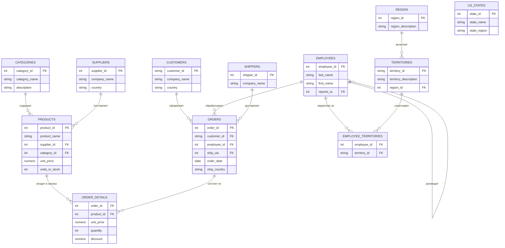

# Структура БД Nordwind

Учебная база данных вымышленной компании "Nordwind Traders",
которая импортирует и экспортирует продукты питания.

## ER-диаграмма

> `US_STATES` не связана с остальными таблицами внешними ключами — отдельный
> справочник штатов США, используется самостоятельно (например, в задачах
> на `GROUP_CONCAT` по регионам).

---

## Таблицы и поля

### categories — категории товаров
| Поле | Описание |
|---|---|
| `category_id` | уникальный идентификатор категории (PK) |
| `category_name` | наименование категории |
| `description` | текстовое описание |
| `picture` | изображение категории |

### customers — клиенты
| Поле | Описание |
|---|---|
| `customer_id` | уникальный идентификатор клиента (PK) |
| `company_name` | наименование компании-клиента |
| `contact_name` / `contact_title` | контактное лицо и должность |
| `address`, `city`, `region`, `postal_code`, `country` | адрес |
| `phone`, `fax` | контакты |

### employees — сотрудники
| Поле | Описание |
|---|---|
| `employee_id` | уникальный идентификатор сотрудника (PK) |
| `last_name`, `first_name`, `title` | имя и должность |
| `birth_date`, `hire_date` | даты рождения и приёма на работу |
| `reports_to` | ссылка на руководителя (FK на эту же таблицу) |
| `address`, `city`, `region`, `postal_code`, `country` | домашний адрес |

### employee_territories — сотрудники и территории (связующая таблица)
| Поле | Описание |
|---|---|
| `employee_id` | FK на `employees` |
| `territory_id` | FK на `territories` |

### orders — заказы
| Поле | Описание |
|---|---|
| `order_id` | уникальный идентификатор заказа (PK) |
| `customer_id` | FK на `customers` |
| `employee_id` | FK на `employees` |
| `ship_via` | FK на `shippers` |
| `order_date`, `required_date`, `shipped_date` | даты заказа |
| `ship_name`, `ship_address`, `ship_city`, `ship_region`, `ship_postal_code`, `ship_country` | адрес доставки |
| `freight` | вес груза |

### order_details — детали заказов (связующая таблица orders ↔ products)
| Поле | Описание |
|---|---|
| `order_id` | FK на `orders` |
| `product_id` | FK на `products` |
| `unit_price` | цена на момент заказа |
| `quantity` | количество единиц |
| `discount` | скидка (доля, например 0.1 = 10%) |

### products — товары
| Поле | Описание |
|---|---|
| `product_id` | уникальный идентификатор товара (PK) |
| `product_name` | наименование |
| `supplier_id` | FK на `suppliers` |
| `category_id` | FK на `categories` |
| `unit_price` | цена за единицу |
| `units_in_stock`, `units_on_order`, `reorder_level` | складские остатки |
| `discontinued` | флаг снятия с продажи (1/0) |

### region — регионы
| Поле | Описание |
|---|---|
| `region_id` | уникальный идентификатор региона (PK) |
| `region_description` | название региона |

### shippers — перевозчики
| Поле | Описание |
|---|---|
| `shipper_id` | уникальный идентификатор перевозчика (PK) |
| `company_name`, `phone` | название и телефон |

### suppliers — поставщики
| Поле | Описание |
|---|---|
| `supplier_id` | уникальный идентификатор поставщика (PK) |
| `company_name`, `contact_name`, `contact_title` | компания и контакт |
| `address`, `city`, `region`, `postal_code`, `country` | адрес |
| `homePage` | сайт поставщика |

### territories — территории
| Поле | Описание |
|---|---|
| `territory_id` | уникальный идентификатор территории (PK) |
| `territory_description` | название территории |
| `region_id` | FK на `region` |

### us_states — штаты США (отдельный справочник)
| Поле | Описание |
|---|---|
| `state_id` | уникальный идентификатор штата (PK) |
| `state_name`, `state_abbr` | название и сокращение |
| `state_region` | регион штата |
